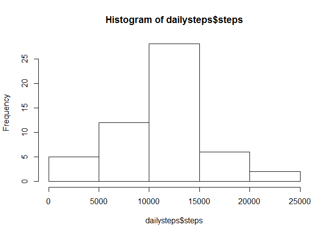
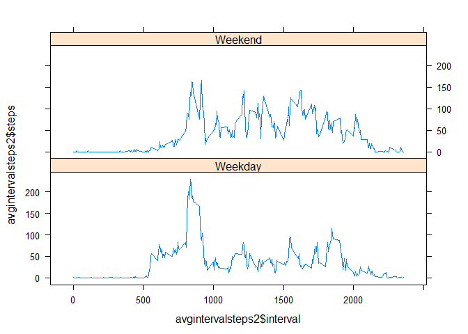

# Reproducible Research: Peer Assessment 1
Hello!  This purpose of this assignment is to create an Rmarkdown document mixing both human-readable documentation and executable R scripts analyzing data from a personal fitness tracking device. So let's get started!  

This Rmarkdown document and analysis was conducted on a PC running Windows 8.1,  R version 3.1.2 (2014-10-31) -- "Pumpkin Helmet".  

### Loading and preprocessing the data

The file containing the data analyzed in this assignment is called "activity.csv"       


```r
wd <- "C:\\Users\\Dane\\Documents\\GitHub\\RepData_PeerAssessment1"
setwd(wd)
data <- read.csv("activity.csv")
```

### What is mean total number of steps taken per day?  

Answering the questions in the analysis happens at various levels of aggregation and I find it very simple to use sqldf library which allows me to conduct aggregations using the SQL query language. This is totally a personal preference because I am already very familiar with SQL. The first analysis step loads the sqldf library and run a quick analysis to sum the total number of steps by day.  


```r
library(sqldf)
dailysteps <- sqldf("select sum(steps) as steps, date
                     from data
                     group by date
                     ")
```

It is quite easy then to show a histogram of the daily steps and compute the mean and median.

```r
hist(dailysteps$steps)
```

 


The mean number of steps/day is 10766.189 and the median steps/day is 10765.  
  

### What is the average daily activity pattern?

To determine the average daily activity pattern, I rely on the sqldf library to aggregate my original data now along the minute interval, computing the average number of steps within an interval across all dates in the dataset.  


```r
avgintervalsteps <-sqldf("select avg(steps) as steps, interval
                          from data
                          group by interval
                        ")
library(lattice)
xyplot(steps~interval, data = avgintervalsteps, type="l")
```

 

```r
maxintervalstep <- sqldf("select max(steps) as maxsteps, interval
                          from avgintervalsteps")
```
The interval with typically the maximum number of steps (206 steps) is 835.  

### Imputing missing values

All previous results were displayed knowing that contained with in the data are several NA.  This could quite possibly indicate device malfunction such that data was not available. It is quite easy to run the summary() function on the original dataset to count the number of NA terms.


```r
summary(data)
```

```
##      steps                date          interval     
##  Min.   :  0.00   2012-10-01:  288   Min.   :   0.0  
##  1st Qu.:  0.00   2012-10-02:  288   1st Qu.: 588.8  
##  Median :  0.00   2012-10-03:  288   Median :1177.5  
##  Mean   : 37.38   2012-10-04:  288   Mean   :1177.5  
##  3rd Qu.: 12.00   2012-10-05:  288   3rd Qu.:1766.2  
##  Max.   :806.00   2012-10-06:  288   Max.   :2355.0  
##  NA's   :2304     (Other)   :15840
```

The strategy selected to impute missing values for NAs is to substitute the average interval value calculated from the available data in the avgintervalsteps variable in for each NA. The is.na() function returns TRUE for each missing NA.  The average interval steps is inserted into the new data set and then the code loops through each row to determine wheter to fill the missing value with the average value.  


```r
data$missing <- is.na(data$steps)
imputeddata <- sqldf("select data.steps,
                      data.date,
                      data.interval,
                      data.missing,
                      avgintervalsteps.steps as avgsteps
                      from data
                      left join
                      avgintervalsteps on data.interval = avgintervalsteps.interval
                      ")
for (i in 1:length(imputeddata$missing)) {
        if (imputeddata$missing[i] == TRUE) 
                {imputeddata$newsteps[i] <- imputeddata$avgsteps[i]}
        else
                {imputeddata$newsteps[i] <- imputeddata$steps[i]}
}
```
Let's take a look to see if it worked by examining the first few rows!

```r
head(data)
```

```
##   steps       date interval missing
## 1    NA 2012-10-01        0    TRUE
## 2    NA 2012-10-01        5    TRUE
## 3    NA 2012-10-01       10    TRUE
## 4    NA 2012-10-01       15    TRUE
## 5    NA 2012-10-01       20    TRUE
## 6    NA 2012-10-01       25    TRUE
```

```r
head(imputeddata)
```

```
##   steps       date interval missing avgsteps newsteps
## 1    NA 2012-10-01        0    TRUE        1        1
## 2    NA 2012-10-01        5    TRUE        0        0
## 3    NA 2012-10-01       10    TRUE        0        0
## 4    NA 2012-10-01       15    TRUE        0        0
## 5    NA 2012-10-01       20    TRUE        0        0
## 6    NA 2012-10-01       25    TRUE        2        2
```
Then repeat the analysis on the daily step counts with this new data set.

```r
dailysteps2 <- sqldf("select sum(newsteps) as steps, date
                      from imputeddata
                      group by date
                      ")
hist(dailysteps2$steps)
```

 


The new mean number of steps/day is 10766.189 and the new median steps/day is 10765.  


### Are there differences in activity patterns between weekdays and weekends?

Because a person's activity level and patterns are likely to be different weekends vs weekdays, the next step is to identify which dates in the data set belong to weekdays and which belong to weekends.  This section of code loops through the imputed data set, evaluating whether the date is a Sunday or a Saturday. If so, the value of "Weekend" gets stored, otherwise the value of "Weekday" gets stored.  After which, the strings are converted to factor variables and sqldf is used again to calculate means for each interval, but segmenting the data along the new weekday variable.

```r
for (i in 1:length(imputeddata$date)) {
        if ((weekdays(as.POSIXct(imputeddata$date[i])) == "Sunday") 
          | (weekdays(as.POSIXct(imputeddata$date[i])) == "Saturday"))
                {imputeddata$weekday[i] <- "Weekend"}
        else
                {imputeddata$weekday[i] <- "Weekday"}
}
#convert the strings to factors
imputeddata$weekday<- as.factor(imputeddata$weekday)
avgintervalsteps2 <-sqldf("select avg(newsteps) as steps, interval, weekday
                           from imputeddata
                           group by interval, weekday
                          ")

xyplot(avgintervalsteps2$steps ~ avgintervalsteps2$interval | avgintervalsteps2$weekday,
       layout = c(1,2), type = "l")
```

 
